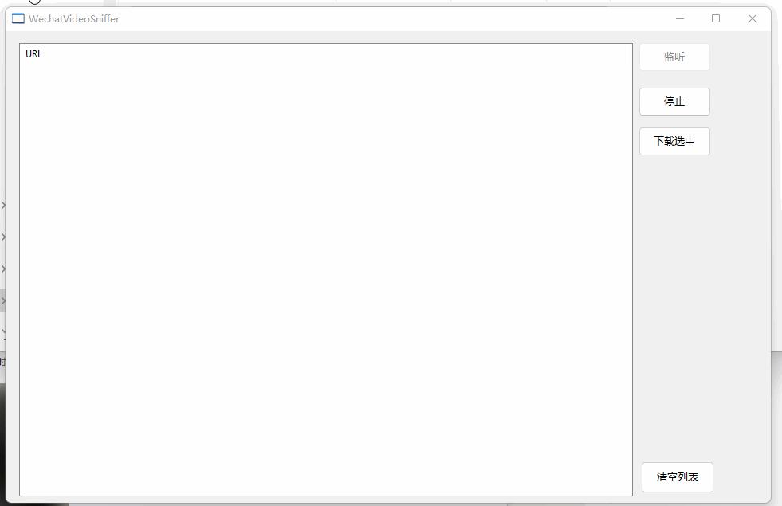

# WechatVideoSniffer
微信视频号PC版视频地址嗅探器

本项目采用[aardio](https://www.aardio.com/)编程语言开发

### 重要提醒
目前初步分析微信视频对流媒体进行加密，尚无逆向方法，可采用如下方法绕过：
~~1. 视频转发至`文件传输助手`，然后关闭微信视频窗口~~
~~2. 从`文件传输助手`打开视频，即可抓到未加密的视频地址~~
pc端微信，搜一搜，在搜索列表播放的视频可以监听到进行下载

## 原理

使用FiddlerCore .Net组件，注册系统代理，监听主机的http/https请求，从而匹配出微信视频号视频的地址

## 使用方法

1. 打开软件，点击`监听`按钮

> 如果第一次运行，会安装一个证书，这个证书的作用是建立中间人捕获https协议

2. 在`PC微信`上打开视频

3. 此时软件列表会更新视频链接，点击`下载选中` 按钮就可以下载视频，视频存放在`download`目录下。

   

   ## 软件获取

   自行编译或工程`dist`目录下载
